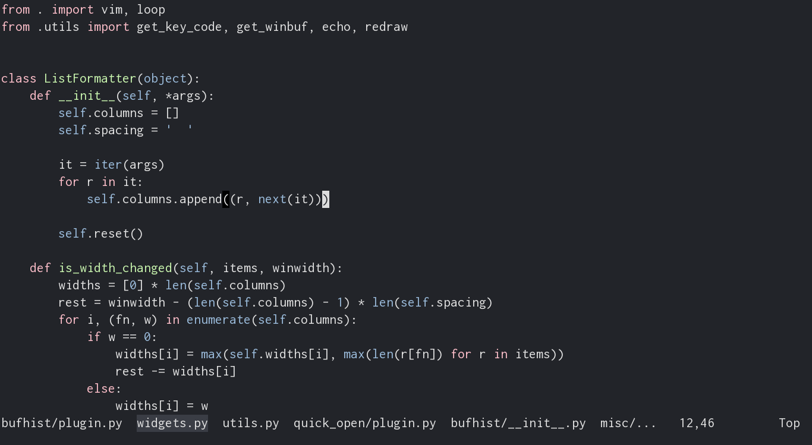
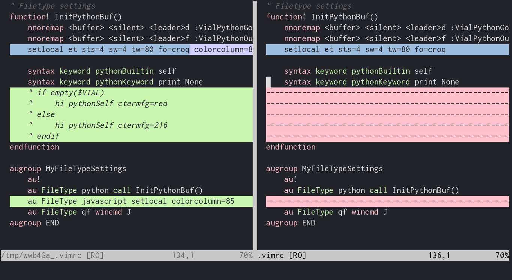

vim-babymate256
===============

Port of gtksourceview babymate scheme for 256-color term

Nearest colors are mathched by CIE76. But you can get exact
colors in xterm and urxvt by executing [escape
sequences](colors/babymate256.vim#L103).

Urxvt with color fix screenshots:

